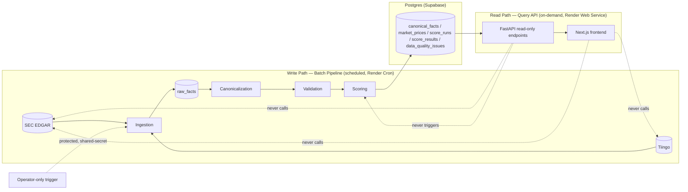
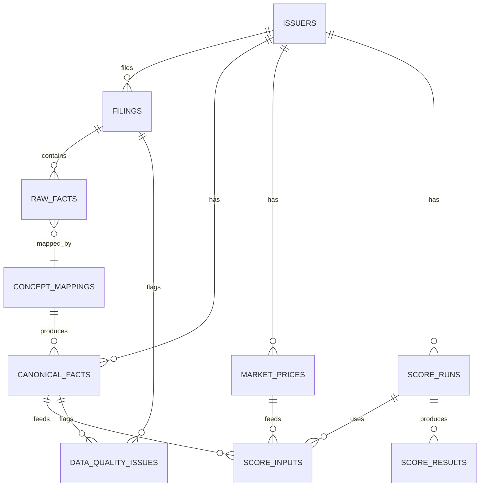

# Architecture Spine — ThesisTrace

## Design Paradigm

**Batch Pipeline (write path) + Read-Only Query API (read path) — CQRS-style split.** The pipeline is internally structured as pipes-and-filters: EDGAR/Tiingo -> ingest -> raw store -> canonicalize -> validate -> score -> Postgres.

- **Write path (batch, scheduled):** ingestion, raw storage, canonicalization, validation, and scoring run on a schedule (Render Cron Job), never inside a user request.
- **Read path (query, on-demand):** FastAPI and Next.js query materialized Postgres state only. They never compute a score, never call EDGAR or Tiingo, and never trigger the pipeline.
- **Why this shape:** the problem is batch-computation-dominant (periodic filings, deterministic scoring against a fixed formula), not runtime-swappable — hexagonal/ports-adapters would add abstraction the problem doesn't need.
- **Maps to source tree:** write path = `backend/ingestion/`, `backend/raw_store/`, `backend/canonicalization/`, `backend/validation/`, `backend/scoring/`, `backend/formulas/`; read path = `backend/api/`, `backend/explanation/`, `frontend/`.

## Invariants & Rules



### AD-1 — Batch Pipeline (write) + Read-Only Query API (read), CQRS-style split

- **Binds:** all
- **Prevents:** the read path computing scores or calling EDGAR/Tiingo live; the write path serving a user-facing request; ports-adapters-style runtime-swappable seams the problem doesn't need.
- **Rule:** all computation runs in the scheduled batch pipeline (ingest -> raw store -> canonicalize -> validate -> score -> Postgres), never inside a request. FastAPI/Next.js only query materialized Postgres. Dependency direction is one-way: pipeline -> Postgres -> API -> frontend (see diagram above).

### AD-2 — Immutable raw storage + versioned canonicalization

- **Binds:** FR-3, FR-4, FR-6, FR-7, FR-8, FR-11
- **Prevents:** raw source data or canonical facts being overwritten or silently reinterpreted, breaking audit trail and reproducibility.
- **Rule:** `raw_facts` is append-only, keyed by `(accession_number, content_hash)`. `canonical_facts` are derived via versioned `concept_mappings`; a mapping change produces a new mapping version, never an in-place mutation.

### AD-3 — Deterministic Canonical Fact selection rules

- **Binds:** FR-3, FR-4, FR-6, FR-7, FR-8
- **Prevents:** silent, arbitrary default selection among ambiguous or conflicting XBRL facts.
- **Rule:** selection order is (1) as-originally-filed over restated comparative, (2) least-dimensioned/most-specific member, (3) higher decimals precision. Any unresolved ambiguity writes a `data_quality_issues` row with status `needs_review` — never a defaulted guess.

### AD-4 — Dual-source ingestion

- **Binds:** FR-3, FR-4, FR-6, FR-7
- **Prevents:** silent gaps for custom-taxonomy facts the Company Facts API omits.
- **Rule:** SEC Company Facts API is the primary ingestion source; raw Inline XBRL parsing is the audit/fallback path for facts the Company Facts API omits.

### AD-5 — Versioned exact formula specification

- **Binds:** FR-3, FR-4, FR-6, FR-7, FR-11
- **Prevents:** ambiguity between named model variants (Altman Z vs Z' vs Z", Beneish 8-var vs 5-var, Sloan balance-sheet vs cash-flow approach) and untracked silent formula changes.
- **Rule:** each formula's equation, inputs, thresholds, rounding policy, missing-data policy, and divide-by-zero policy lives in a versioned config/spec artifact (e.g. `formulas/piotroski_v1.yaml`), not a DB table. Every `score_run` records the `formula_version` used, referencing the spec version by string.

### AD-6 — Append-only versioned score_runs

- **Binds:** FR-3, FR-4, FR-6, FR-7
- **Prevents:** amended/restated filings (10-K/A) silently overwriting or invalidating prior scores.
- **Rule:** an amendment triggers a new `score_run` referencing the new `canonical_facts`; the prior run is marked superseded, never deleted or mutated. Resolves PRD Open Question 2.

### AD-7 — Deterministic-first explanation; LLM as constrained rewrite only

- **Binds:** FR-12
- **Prevents:** the LLM introducing a new claim, number, or citation not already present in `score_results`/`canonical_facts`.
- **Rule:** explanation text is generated as a template directly from `score_results`/`canonical_facts`, with no LLM in the computation loop. An LLM, if used, may only rewrite/polish already-correct text — never originate content. Tightens FR-12 beyond the PRD's "cited narrative" language; flagged as a PRD-touching refinement pending PM confirmation.

### AD-8 — Strict Python/TypeScript domain boundary

- **Binds:** all
- **Prevents:** scoring or canonicalization logic leaking into the frontend.
- **Rule:** Python owns ingestion, canonicalization, and all score computation. Next.js owns presentation only — it renders exactly what the read API returns and contains no scoring/canonicalization logic.

### AD-9 — EDGAR access discipline

- **Binds:** FR-3, FR-4, FR-6, FR-7 (ingestion)
- **Prevents:** violating SEC fair-access policy, or non-reproducible ingestion runs.
- **Rule:** ingestion uses an identifying User-Agent, stays at or under 10 req/s, caches and retries with backoff, is idempotent by `(accession_number, content_hash)`, and is replayable.

### AD-10 — Read path never triggers writes

- **Binds:** FR-1, FR-2, FR-5, FR-8, FR-9, FR-10, FR-13, FR-14
- **Prevents:** an anonymous user request triggering recomputation or pipeline execution.
- **Rule:** all public FastAPI endpoints are read-only against materialized Postgres. Recompute/admin operations require a protected, operator-only path (shared-secret header), never exposed anonymously. Ties to foundational-decisions D4 (no end-user auth; operator-only if any).

### AD-11 — Altman market-data gap resolved via Tiingo `[ADOPTED]`

- **Binds:** FR-4, FR-5
- **Prevents:** substituting book value for market value of equity, or using `EntityPublicFloat` (wrong as-of date — Q2, not FYE).
- **Rule:** Altman Z-Score's market value of equity = period-end closing price (Tiingo free tier) x EDGAR `dei:EntityCommonStockSharesOutstanding` at FYE. Altman stays in Phase 1 scope; never computed with a book-value substitute.

### AD-12 — Verdict synthesis: per-model threshold juxtaposition `[ADOPTED]`

- **Binds:** FR-9
- **Prevents:** the Verdict becoming a further blended/weighted single number across models, or an LLM-invented figure.
- **Rule:** the Verdict shows each live model's own published, cited threshold classification side by side (Piotroski 8-9 Strong/5-7 Moderate/0-4 Weak; Altman >2.99 Safe/1.81-2.99 Grey/<1.81 Distress; Beneish >-1.78; Sloan per its versioned formula-spec threshold) — never combined into one score.

### AD-13 — Backend hosting = Render `[ADOPTED]`

- **Binds:** all (infra)
- **Prevents:** split-platform DevOps overhead for a solo builder (Fly.io lacks built-in cron; Railway has no free tier and per-service billing).
- **Rule:** the FastAPI read API runs as a Render Web Service; the scheduled batch pipeline runs as a Render Cron Job. Both on one platform/bill.

### AD-14 — market_prices entity

- **Binds:** FR-4
- **Prevents:** Altman computation depending on a live, unlogged Tiingo call at read time.
- **Rule:** `market_prices` (`issuer_id`, `price_date`, `close_price`, `source`, `fetched_at`) persists every fetched close price. Altman computation joins through this table; it never calls Tiingo live during a read request.

### AD-15 — NUMERIC/DECIMAL, never FLOAT/DOUBLE

- **Binds:** FR-3, FR-4, FR-6, FR-7, SM-1
- **Prevents:** silent floating-point rounding divergence between independently-built calculation code, which would break golden-dataset matching (SM-1) in hard-to-trace ways.
- **Rule:** every financial figure stored or computed anywhere in the pipeline or Postgres schema is `NUMERIC`/`DECIMAL`. `FLOAT`/`DOUBLE` is never used for a financial value.

## Consistency Conventions

| Concern | Convention |
| --- | --- |
| Naming (entities, files, interfaces, events) | Internal PKs are UUID, except `issuers` (keyed by CIK string) and `filings` (keyed by SEC `accession_number` string) — natural external keys. |
| Data & formats (ids, dates, error shapes, envelopes) | `DATE` for fiscal/filing dates; `TIMESTAMPTZ` for `computed_at`/`fetched_at`; ISO 8601 throughout. All FastAPI errors use one documented envelope: `{error: {code, message, details}}`. Financial figures are `NUMERIC`/`DECIMAL` only, never `FLOAT`/`DOUBLE` (AD-15). |
| State & cross-cutting (mutation, errors, logging, config, auth) | Config via env vars only for secrets (EDGAR contact, Tiingo key, LLM key, DB connection) — never hardcoded. No end-user auth in Phase 1 (foundational-decisions D4); admin/recompute endpoints protected by a shared-secret header, operator-only, not a full auth system. |

## Stack

| Name | Version |
| --- | --- |
| Next.js | 16.2.10 |
| React | 19.2.7 |
| FastAPI | 0.136.x |
| Pydantic | 2.10.x |
| SQLAlchemy | 2.0.36 (async `AsyncSession`) |
| Python | 3.12 / 3.13 |
| Postgres (Supabase) | 17 |
| Render | Web Service + Cron Job (~$8-10/mo) |
| Vercel | free/hobby tier ($0) |
| Tiingo | free tier API ($0) |

## Structural Seed



```text
ThesisTrace/
  frontend/           # Next.js — presentation only, renders read API output (AD-8)
    app/               # overview, methodology, comparison pages
  backend/
    ingestion/         # EDGAR Company Facts + Inline XBRL fallback, Tiingo close price (AD-4, AD-9)
    raw_store/         # raw_facts — append-only (AD-2)
    canonicalization/  # concept_mappings, canonical fact selection (AD-2, AD-3)
    validation/        # data_quality_issues, accounting-identity checks (AD-3)
    formulas/          # versioned formula specs, e.g. piotroski_v1.yaml (AD-5)
    scoring/           # score_runs / score_inputs / score_results (AD-5, AD-6, AD-15)
    explanation/       # deterministic template + constrained LLM rewrite (AD-7)
    api/               # FastAPI read-only query endpoints (AD-1, AD-10)
  db/
    migrations/        # schema incl. market_prices (AD-14)
```

**Deployment & environments:** Render Web Service (FastAPI read API) + Render Cron Job (batch pipeline), both on one platform/bill (AD-13). Vercel free/hobby tier for the Next.js frontend. Supabase free-tier Postgres 17 (500MB DB, 5GB egress) auto-pauses after 7 days of DB inactivity; the daily scheduled batch ingestion job doubles as the keep-alive ping, so no extra mechanism is needed. Single production environment plus local dev (Python/Node run locally against a local or dev Supabase project) — no staging tier, matching hobby/solo scale; NFR rigor (monitoring, alerting, rollback) is deferred to Phase 4.

## Capability → Architecture Map

| Capability / Area | Lives in | Governed by |
| --- | --- | --- |
| FR-1 Starter list display | `frontend/app` | AD-8, AD-10 |
| FR-2 Ticker search | `frontend/app`, `backend/api` | AD-8, AD-10 |
| FR-3 Piotroski F-Score | `backend/scoring`, `backend/formulas` | AD-2, AD-3, AD-4, AD-5, AD-6, AD-15 |
| FR-4 Altman Z-Score | `backend/scoring`, `backend/formulas`, `market_prices` | AD-2, AD-3, AD-4, AD-5, AD-6, AD-11, AD-14, AD-15 |
| FR-5 Quality/Health sub-signal display | `backend/api`, `frontend/app` | AD-3, AD-10 |
| FR-6 Beneish M-Score | `backend/scoring`, `backend/formulas` | AD-2, AD-3, AD-4, AD-5, AD-6, AD-15 |
| FR-7 Sloan accruals ratio | `backend/scoring`, `backend/formulas` | AD-2, AD-3, AD-4, AD-5, AD-6, AD-15 |
| FR-8 Integrity sub-signal display & Provenance | `backend/api`, `backend/validation` | AD-3, AD-10 |
| FR-9 Company overview page (Verdict) | `backend/api`, `frontend/app` | AD-8, AD-10, AD-12 |
| FR-10 Expandable sub-factor breakdown | `frontend/app` | AD-8, AD-10 |
| FR-11 Methodology page per score | `backend/formulas`, `frontend/app` | AD-5 |
| FR-12 Cited narrative explanation | `backend/explanation` | AD-7 |
| FR-13 Add to comparison | `frontend/app` (session-only) | AD-8 |
| FR-14 Side-by-side comparison view | `backend/api`, `frontend/app` | AD-8, AD-10 |
| FR-15 Cited filing Q&A | Deferred | — |
| FR-16 Valuation metrics | Deferred | — |
| FR-17 Growth trajectory metrics | Deferred | — |
| FR-18 Thesis save and re-verification | Deferred | — |
| FR-19 Thesis re-verification notification | Deferred | — |
| FR-20 Deep research request submission | Deferred | — |
| FR-21 Deep research fulfillment notification | Deferred | — |

## Deferred

- **Phase 2 entities (thesis/thesis_diff tables)** — FR-18 depends on Filing Q&A maturity and a browser-local persistence design not yet settled.
- **Phase 3 entities (deep_research_requests, notifications)** — FR-19-21 depend on async queue/worker infrastructure and Filing Q&A maturity, both Phase 2/3 work.
- **LangGraph Filing Q&A orchestration internals** — FR-15 is directional only in the PRD; detailed at that phase's own architecture pass.
- **Full auth system** — a startup-optional pivot per foundational-decisions D4; not needed while the product stays single-user/no-login.
- **SEDAR+/TSX-only ingestion pipeline** — explicit PRD Non-Goal, no phase scheduled.
- **Exact accounting-identity validation rule set** — the `data_quality_issues` tracking mechanism exists now; the specific checks are an implementation detail, not a spine-level invariant.
- **Sloan accruals exact threshold value** — pinned in the versioned formula spec (AD-5) at implementation time, not at spine level.
- **CI/CD, monitoring, rollback** — Phase 4 per the PRD; hobby-scale posture defers operational rigor.
