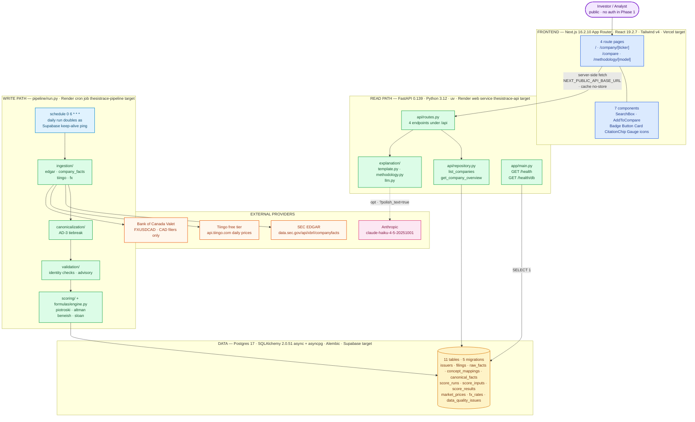

# System Architecture

ThesisTrace end to end: a read-only Next.js frontend over a FastAPI query API, backed by
Postgres, with a separate scheduled batch pipeline owning the entire write path.

The split down the middle is the point. **Nothing on the read path ever calls an external
provider or computes a score** — the API only reads rows the batch pipeline already wrote.

## Reading the diagram

The two paths meet only at the database. The read path (top) is synchronous and serves
requests; the write path (bottom) runs once a day on a schedule and is the *only* thing that
talks to SEC EDGAR, Tiingo, or the Bank of Canada. A dotted edge is the one optional call —
the Anthropic rewrite, which is skipped unless explicitly requested.

## Deployment status — honest snapshot

`render.yaml` defines both services and CI is green, but **no environment is live**. Every
host named in a subgraph title is a configured target, not a running machine.

| Target | Config | Provisioned |
|---|---|---|
| Render — `thesistrace-api` web service | `render.yaml`, `healthCheckPath: /health` | ❌ not yet |
| Render — `thesistrace-pipeline` cron | `render.yaml`, `0 6 * * *` | ❌ not yet |
| Supabase Postgres | `DATABASE_URL` (`sync: false`) | ❌ not yet — local Docker `thesistrace-pg` only |
| Vercel | — | ❌ not yet, no `vercel.json` |

Local dev runs the API at `http://localhost:8000` (the `NEXT_PUBLIC_API_BASE_URL` fallback)
against the Docker Postgres container. Four secrets are declared `sync: false` on both Render
services: `DATABASE_URL`, `EDGAR_CONTACT`, `TIINGO_API_KEY`, `LLM_API_KEY`.

## CI

`.github/workflows/ci.yml` runs on push to `main` and on every PR, as two parallel jobs:

| Job | Steps |
|---|---|
| `backend` | `postgres:17` service container → `uv sync --locked --all-groups` → `alembic upgrade head` (from repo root) → `ruff check` → `pytest` (57 tests) |
| `frontend` | Node 22 → `npm ci` → `eslint` → `next build` |

**There is no deploy step.** CI proves the build and tests; nothing is shipped from it.

## API surface

Six endpoints total. Only the four under `/api` are public product surface.

| Method | Path | Reads | Notes |
|---|---|---|---|
| GET | `/health` | — | Liveness, no dependencies |
| GET | `/health/db` | `SELECT 1` | Readiness, 503 envelope on failure |
| GET | `/api/companies` | `issuers` | Company cards |
| GET | `/api/companies/{ticker}/overview` | `score_runs`, `score_results`, `score_inputs`, `canonical_facts`, `filings`, `data_quality_issues` | Verdict per model |
| GET | `/api/companies/{ticker}/explanation` | same as overview | `?polish_text=true` enables the LLM rewrite |
| GET | `/api/methodology/{model}` | `formulas/specs/*.yaml` | No DB access |

An uncovered company returns a **200 with `state: not_available`** — never an error and never
a fabricated zero. Unhandled errors use one envelope: `{error: {code, message, details}}`.
