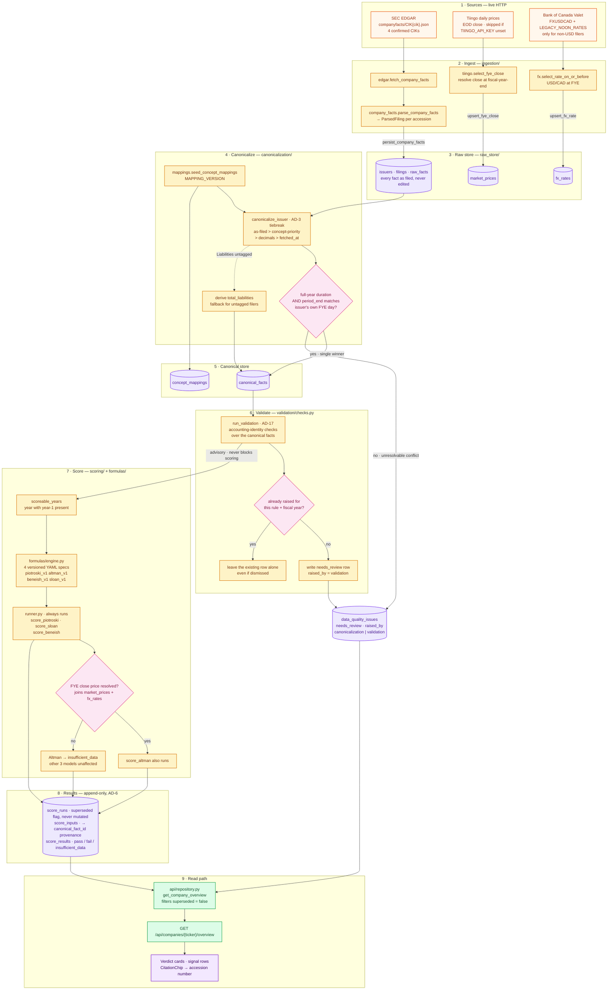

# Data Pipeline

The write path, end to end: `pipeline/run.py` orchestrates **ingest → canonicalize → validate → score**
for each of the four Phase-1 issuers, then commits. The read API never enters this flow — it
only queries the tables this pipeline wrote.

Every arrow below is deterministic Python. No LLM touches any value on this path.

## Phase-1 universe

Four issuers, all US-GAAP 10-K filers, all CIKs confirmed live against `data.sec.gov`
before being hardcoded in `pipeline/universe.py`. An entry with `cik: None` is **skipped and
reported**, so coverage gaps stay explicit rather than silently disappearing.

| Ticker | Company | CIK | Flags |
|---|---|---|---|
| SHOP | Shopify Inc. | `0001594805` | — |
| CP | Canadian Pacific Kansas City Limited | `0000016875` | `capital_intensive` → Altman caveat; reports in **CAD** |
| QSR | Restaurant Brands International Inc. | `0001618756` | — |
| OTEX | Open Text Corporation | `0001002638` | non-Dec-31 FYE (June 30) |

## Degradation rules — why a stage can be skipped

The pipeline is built so a missing input narrows the output rather than failing the run:

- **No `TIINGO_API_KEY`** → `_fye_prices_for` returns `{}`, Altman shows `insufficient_data`, and Piotroski / Beneish / Sloan still score normally.
- **Non-USD filer with no FX source** → only USD/CAD is supported; any other currency returns `{}` and Altman X4 degrades rather than silently dividing mismatched currencies.
- **Unresolvable fact conflict** → a `data_quality_issues` row flagged `needs_review`, never a guess or a default.
- **Missing input to a signal** → `insufficient_data`, never a defaulted `0`/`false` (AD-16 tri-state).

## The validate stage

`run_validation` runs between canonicalize and score, matching the spine's stage order. Two
properties are worth knowing because they are load-bearing:

**It is advisory, never blocking.** A failed accounting identity writes a `needs_review` row
that the read API surfaces (FR-8); it does not stop scoring. One bad identity in one fiscal
year should not suppress every other year's valid scores — the same reasoning behind the
tri-state `insufficient_data` rule.

**It is idempotent, like `canonicalize_issuer`.** The pipeline is a daily cron, so a
violation that stays present must not accumulate a fresh row every night — the read API
selects every issue whose status is not `dismissed`, so duplicates would surface as the same
warning repeated N times after N days. Issues are keyed by `(rule, fiscal_year)` per issuer,
and an existing key is left alone **regardless of status**: re-raising a `dismissed` issue
would resurrect a warning a human deliberately cleared.

The Phase-1 rule set is deliberately small (current assets ≤ total assets, current
liabilities ≤ total assets). Per the spine's Deferred list, the rule set itself is an
implementation detail expected to grow.
