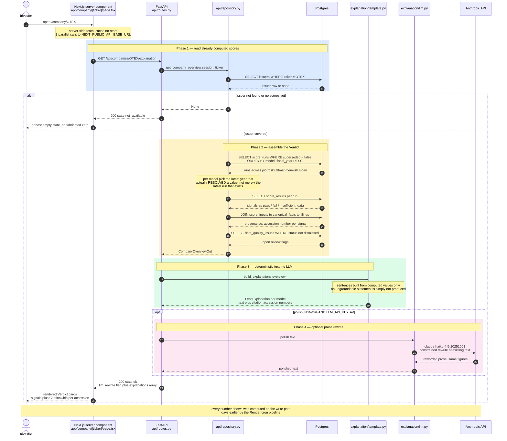

# Explanation Lifecycle

One request traced end to end: a visitor opens a company page and gets a narrative
explanation of its Verdict scores.

This is the flow that enforces the project's central constraint — **the LLM never originates a
number.** Every figure is computed in Python and persisted before the request starts; the
optional Anthropic call receives already-final text and is allowed only to rewrite prose.
If the LLM is disabled, unreachable, or errors, the user still gets the complete, cited
deterministic explanation.

## Participants — real modules

| Participant | File | Role |
|---|---|---|
| Next.js server component | `frontend/app/company/[ticker]/page.tsx` | Fetches `overview`, `explanation`, `methodology` server-side |
| FastAPI route | `backend/api/routes.py:45` | `GET /api/companies/{ticker}/explanation` |
| Repository | `backend/api/repository.py:85` | `get_company_overview` — the only DB reader |
| Template | `backend/explanation/template.py` | Deterministic sentence construction (FR-12, AD-7, AD-19) |
| LLM adapter | `backend/explanation/llm.py` | `polish` — lazy `anthropic` import, gated |

## Why the LLM step is `opt`, not required

Three independent gates must all be true before Anthropic is called:

1. The request must pass `?polish_text=true` — the default is `false`.
2. `rewrite_enabled()` must be true, which requires `LLM_API_KEY` to be set.
3. The `anthropic` package is imported **lazily inside the call**, so the dependency is only touched when a rewrite actually runs.

The response reports which path was taken via the `llm_rewrite` boolean, so a consumer can
always tell whether text was model-touched. The scores themselves are byte-identical either
way — they came out of `score_runs`.

## The subtle bug this flow already survived

Step 8's note is not decoration. `get_company_overview` originally selected each model's
latest *existing* run regardless of whether it resolved a value. Because Beneish needs eight
sub-indices to resolve simultaneously, a newer `insufficient_data` run would mask QSR's and
OTEX's real historical M-Scores. The fix — pick the latest year that actually resolved — is
why the note calls it out explicitly as part of the contract, not an implementation detail.
